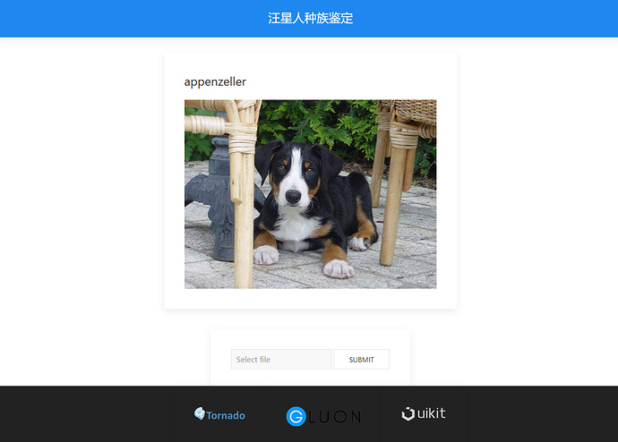

使用上篇的120种狗分类得到的网络模型，就可以搞一个简单的web网页了。  
这里使用了`uikit`最为UI前端库，`tornado`最为web和服务器框架。
## 1. 搞个输出结果的东东
这里只给出这一部分，全部参看上一篇和完整代码  
具体作用就是读取图像文件然后跑一遍网络，根据标签文件得到这到底是哪条狗
``` python
class Pre():
    def __init__(self,nameparams,idx,ctx=0):
        self.idx = idx
        if ctx == 0:
            self.ctx = mx.cpu()
        if ctx == 1:
            self.ctx = mx.gpu()
        self.net = Net(self.ctx,nameparams=nameparams).net
        self.Timg = transform_test
    def PreImg(self,img):
        imgs = self.Timg(img,None)
        out = nd.softmax(self.net(nd.reshape(imgs[0],(1,3,224,224)).as_in_context(self.ctx),nd.reshape(imgs[1],(1,3,299,299)).as_in_context(self.ctx))).asnumpy()
        return self.idx[np.where(out == out.max())[1][0]]
    def PreName(self,Name):
        img = image.imread(Name)
        return self.PreImg(img)
```
## 2. 编写web
### 2.1 文件目录框架
- static (存放静态文件，包括css和js文件)
    - css
    - js
    - icon
    - image
- templates (存放模板文件，这里就一个主页)
    - index.html
- app.py (web主代码)
- model.py  (网络模型代码)  

把css和js代码分别放在css和js文件夹下，把模板主页放在模板文件夹下。另外我还放了三个图标放在了icon目录下。
### 2.2 编写web主代码
这是使用了tornado这个框架，因为我刚开始准备学web框架，看这个眼熟。  
导入各种包
``` python
import os.path
import tornado.httpserver
import tornado.ioloop
import tornado.options
import tornado.web
import os
import pickle
from tornado.options import define, options
from model import Pre #这个就是上面的那个类
``` 
首先搞好预测代码
``` python
netparams = 'train.params'
ids_synsets_name = 'ids_synsets'
f = open(ids_synsets_name,'rb')
ids_synsets = pickle.load(f)
f.close()
PP = Pre(netparams,ids_synsets[1],1)
```
因为上传的图片是暂存在静态目录里的，所以，每次上传的时候，我就把之前的所有图片都删了。免得占空间  
``` python
def RemoveFile(dirhname):
    for root, dirs, files in os.walk(dirhname):
        for name in files:
            os.remove(os.path.join(root, name))
```
首页请求代码
``` python
class IndexHandler(tornado.web.RequestHandler):
    def get(self):
        self.render('index.html',imagename="",classname="")
```
然后就是上传网页的处理函数
``` python
class Update_Image(tornado.web.RequestHandler):
    def post(self):
        RemoveFile("./static/image/")
        img = self.request.files['file'][0]
        f = open("./static/image/"+img['filename'],'wb')
        f.write(img['body'])
        f.close()
        classname = PP.PreName("./static/image/"+img['filename']).lower()
        self.render('index.html',imagename="./static/image/"+img['filename'],classname = classname)
```
然后就是启动代码了
``` python
define("port", default=8000, help="run on the given port", type=int)
if __name__ == '__main__':
    tornado.options.parse_command_line()
    app = tornado.web.Application(
        handlers=[(r'/', IndexHandler), (r'/Updata_Image', Update_Image)],
        template_path=os.path.join(os.path.dirname(__file__), "./templates"),
        static_path=os.path.join(os.path.dirname(__file__),'./static'),
        debug=True
    )
    http_server = tornado.httpserver.HTTPServer(app)
    http_server.listen(options.port)
    tornado.ioloop.IOLoop.instance().start()
```
## 3. 写网页
这块也是现学现写，ui库用的是`uikit`
``` html
<!DOCTYPE html>
<html>

<head>
    <title>Index</title>
    <title></title>
    <link rel="stylesheet" href="{{ static_url("css/uikit.min.css ")}}" />
    <script src="{{ static_url("js/jquery.js ")}}"></script>
    <script src="{{ static_url("js/uikit.min.js ")}}"></script>
</head>

<body>
    <div uk-grid class="uk-flex uk-flex-column">
        <div class=" uk-background-primary uk-position-top" uk-grid>

            <div class="uk-card uk-card-body uk-card-primary uk-width-1-1 ">
                <h3 class="uk-card-title uk-position-center">汪星人种族鉴定</h3>

            </div>

        </div>


        <div uk-grid>
            <div class="uk-margin-auto uk-margin-large-top ">
                <div class="uk-card uk-card-default uk-card-hover  uk-card-body">
                    <h3 class="uk-card-title">{{classname}}</h3>
                    
                </div>
            </div>
        </div>


        <div uk-grid>
            <div class="uk-margin-auto uk-margin-xlarge-bottom  ">
                <div class="uk-card uk-card-default  uk-card-hover uk-card-body">
                    <form method='post' action='/Updata_Image' enctype=multipart/form-data>
                        <div class="uk-margin" uk-margin>
                            <div uk-form-custom="target: true">
                                <input type="file" name=file>
                                <input class="uk-input uk-form-width-medium" type="text" placeholder="Select file" disabled>
                            </div>
                            <button class="uk-button uk-button-default">Submit</button>
                        </div>
                    </form>
                </div>
            </div>
        </div>


        <div class=" uk-background-secondary uk-position-bottom uk-position-fixed" uk-grid>
            <div class="uk-margin-auto uk-grid-small uk-flex uk-flex-row" uk-grid>
                <div class="uk-card uk-card-body uk-card-secondary" title="这是一个基于Python的Web框架和服务器" uk-tooltip>
                    <a href="http://www.tornadoweb.org" target="_blank">
                        
                    </a>
                </div>
                <div class="uk-card uk-card-body uk-card-secondary" title="这是一个深度学习框架Mxnet的Python前端接口" uk-tooltip>
                    <a href="http://zh.gluon.ai/" target="_blank">
                        
                    </a>

                </div>
                <div class="uk-card uk-card-body uk-card-secondary " title="这是一个Web前端框架" uk-tooltip>
                    <a href="https://getuikit.com/" target="_blank">
                        
                    </a>

                </div>
            </div>

        </div>

    </div>

</body>

</html>
```
## 4. 运行看看效果
运行`app.py`文件，看看效果  

